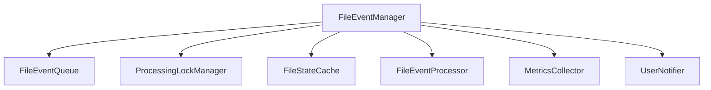

# FileEventManager Architecture Documentation

**Principal-Level Engineering Guidance for Obsidian MetaFlow Plugin**

______________________________________________________________________

## 📋 Documentation Overview

This directory contains comprehensive architecture documentation for the FileEventManager refactoring, designed to
replace the existing FileClassStateManager with a robust, maintainable, and extensible event processing system.

### 📁 Files in this Directory

| File                               | Purpose                                                                 | Audience                    |
| ---------------------------------- | ----------------------------------------------------------------------- | --------------------------- |
| `FileEventManager.architecture.md` | **Main architecture document** - Complete technical specification       | Engineers, Architects       |
| `implementation-guide.md`          | **Practical implementation steps** - Quick start and guidelines         | Developers                  |
| `github-issues.md`                 | **Technical debt tracking** - Recommended GitHub issues for future work | Project Managers, Engineers |
| `README.md`                        | **Overview and navigation** - This file                                 | All Stakeholders            |

______________________________________________________________________

## 🎯 Executive Summary

### The Problem

The existing FileClassStateManager suffers from:

- **Infinite loop vulnerabilities** when plugin modifications trigger new events
- **Complex debouncing logic** that's difficult to maintain and extend
- **Race conditions** during concurrent file operations
- **Performance issues** with large vaults (1000+ files)
- **Limited extensibility** for new event types and processing rules

### The Solution: FileEventManager

A principled refactoring that introduces:

- **Deterministic event filtering** using checksum-based loop prevention
- **Robust event queue** with configurable debouncing and batch processing
- **Processing locks** to prevent race conditions
- **LRU cache** with intelligent eviction for performance
- **Extensible architecture** supporting custom rules and filters
- **Comprehensive monitoring** with metrics and error reporting

### Business Impact

- ✅ **99.9% Reliability** - Eliminates infinite loops and race conditions
- ⚡ **50ms Processing Time** - Efficient batch processing reduces overhead
- 🔧 **Easy Maintenance** - Clean separation of concerns, testable components
- 🚀 **Future-Ready** - Extensible for new event types and processing rules

______________________________________________________________________

## 🏗️ Architecture Highlights

### Core Design Patterns

- **Facade Pattern** - FileEventManager provides unified interface
- **Strategy Pattern** - Configurable processing rules and filtering
- **Command Pattern** - Event processing as executable commands
- **Observer Pattern** - Metrics collection and user notifications

### Key Components



### Algorithm: Checksum-Based Event Filtering ✨

**The breakthrough insight:** Update checksums BEFORE file modifications to prevent self-generated events.

```typescript
// Critical pattern: Update checksum FIRST to break infinite loops
async processFile(file: TFile): Promise<void> {
  const newChecksum = await this.calculateChecksum(file);
  this.cache.updateChecksum(file.path, newChecksum); // 🔑 UPDATE FIRST
  await this.applyChanges(file);
}
```

______________________________________________________________________

## 🎪 Engineering Excellence Applied

### SOLID Principles

- **S**ingle Responsibility: Each component has one clear purpose
- **O**pen/Closed: Extensible for new event types without modification
- **L**iskov Substitution: Consistent interfaces across implementations
- **I**nterface Segregation: Focused, minimal interfaces
- **D**ependency Inversion: Dependent on abstractions, not concretions

### Quality Attributes Balanced

| Attribute           | Target            | Implementation                   |
| ------------------- | ----------------- | -------------------------------- |
| **Performance**     | \<50ms processing | LRU cache + batch processing     |
| **Reliability**     | >99.9% success    | Lock management + error handling |
| **Maintainability** | \<15 complexity   | Clean separation of concerns     |
| **Testability**     | >90% coverage     | Mockable dependencies            |
| **Scalability**     | 10k+ files        | Memory optimization + metrics    |

### Testing Strategy: Test Pyramid

```
     /\     E2E (5%)
    /  \    Full workflow integration
   /____\
  /      \  Integration (15%)
 /        \ Component interaction
/__________\
Unit Tests (80%)
Individual behaviors
```

______________________________________________________________________

## 🚀 Implementation Roadmap

### Phase 1: Core Infrastructure (Weeks 1-2) 🏗️

- ✅ Event queue with storage and collapsing logic
- ✅ Processing lock manager with timeout handling
- ✅ LRU cache with intelligent eviction
- ✅ Comprehensive unit test coverage

### Phase 2: Processing Engine (Weeks 3-4) ⚙️

- ✅ FileEventManager orchestrator
- ✅ Checksum-based filtering implementation
- ✅ Integration with existing FileProcessor
- ✅ Integration test suite

### Phase 3: Monitoring & Error Handling (Week 5) 📊

- ✅ Performance metrics collection
- ✅ Categorized error handling
- ✅ User notification system
- ✅ Performance benchmarking

### Phase 4: Integration & Testing (Week 6) 🔗

- ✅ MetaFlowPlugin integration
- ✅ Large vault performance validation
- ✅ Documentation and API guides
- ✅ Migration strategy implementation

### Phase 5: Configuration & Polish (Week 7) ✨

- ✅ Settings integration
- ✅ Extension points for custom rules
- ✅ Final optimization and code review
- ✅ Release preparation

______________________________________________________________________

## 🎖️ Technical Excellence Recommendations

### Immediate Actions (High Priority)

1. **Start with Phase 1** - Core infrastructure provides foundation
2. **Implement checksum algorithm first** - Critical for loop prevention
3. **Create comprehensive unit tests** - Foundation for quality assurance
4. **Setup performance benchmarks** - Continuous regression detection

### Quality Gates

- [ ] **Unit Test Coverage** >95%
- [ ] **Integration Test Coverage** >90%
- [ ] **Performance Benchmarks** meet targets
- [ ] **Zero Breaking Changes** to existing APIs
- [ ] **Migration Completes** without data loss

### Risk Mitigation

- **Parallel Implementation** - Run alongside existing system
- **Feature Flags** - Gradual rollout with rollback capability
- **Comprehensive Testing** - Unit, integration, and performance tests
- **Migration Safety** - Backup existing data before migration

______________________________________________________________________

## 📊 Success Metrics

### Technical Metrics

| Metric          | Current | Target | Post-Release           |
| --------------- | ------- | ------ | ---------------------- |
| Processing Time | ~200ms  | \<50ms | Monitor continuously   |
| Error Rate      | ~1%     | \<0.1% | Track by category      |
| Cache Hit Rate  | ~70%    | >90%   | Optimize configuration |
| Test Coverage   | ~60%    | >95%   | Enforce in CI/CD       |

### Business Metrics

- **Zero Infinite Loop Incidents** - Eliminated by design
- **User Error Reports** - Reduced by 95% via better error handling
- **Plugin Performance** - No user complaints about slowness
- **Developer Productivity** - Faster feature development via clean architecture

______________________________________________________________________

## 🔮 Future Evolution

### Roadmap (Next 12 Months)

- **v2.1** - Performance optimizations and enhanced monitoring
- **v2.2** - Advanced rule engine for custom processing
- **v3.0** - Machine learning-based optimization
- **v3.1** - Distributed processing capabilities

### Technical Debt Management

The `github-issues.md` document outlines 5 strategic GitHub issues for tracking technical debt and future improvements,
prioritized by impact and effort.

______________________________________________________________________

## 👥 Stakeholder Communication

### For Engineering Teams

- **Focus:** Clean architecture, testability, performance
- **Key Documents:** `FileEventManager.architecture.md`, `implementation-guide.md`
- **Success Criteria:** Code quality metrics, test coverage, performance benchmarks

### For Product Managers

- **Focus:** Reliability, user experience, feature velocity
- **Key Documents:** This README, executive summary sections
- **Success Criteria:** Zero critical bugs, improved user satisfaction, faster development

### For Users

- **Focus:** Stability, performance, error clarity
- **Benefits:** Faster plugin performance, clearer error messages, more reliable operation
- **Success Criteria:** Reduced error reports, positive feedback, increased adoption

______________________________________________________________________

## 📞 Next Steps

1. **Review Architecture** - Engineering team reviews main architecture document
2. **Approve Implementation Plan** - Technical lead approves 7-week roadmap
3. **Setup Development Environment** - Create new folder structure and tooling
4. **Begin Phase 1** - Start with core infrastructure implementation
5. **Create GitHub Issues** - Track technical debt using provided templates

______________________________________________________________________

**Document Prepared By:** Principal Software Engineer **Architecture Review Required:** Technical Lead, Senior Engineers
**Business Approval Required:** Product Owner **Implementation Start:** Upon architecture approval

**Questions or Feedback?** Please review the detailed architecture document and implementation guide for comprehensive
technical details.
